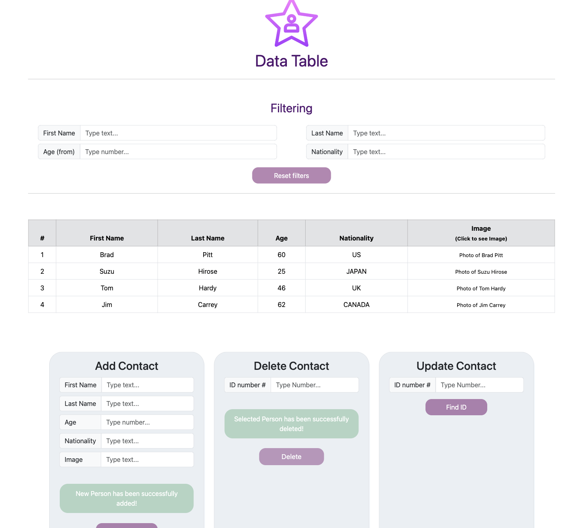

#  Data-table of poeple  

Responsive CRUD data table created with javascript & bootstrap. Practising "DOM", dynamic addition, update and removal of table elements, filtering function, validations, modal window implementation and local storage implementation.

<h4>🔹  Data table sample - <a href="https://simonakom.github.io/crud-people-data-table/dynamic-table.html" style="font-size:small;">View</a><h4>

    
    

